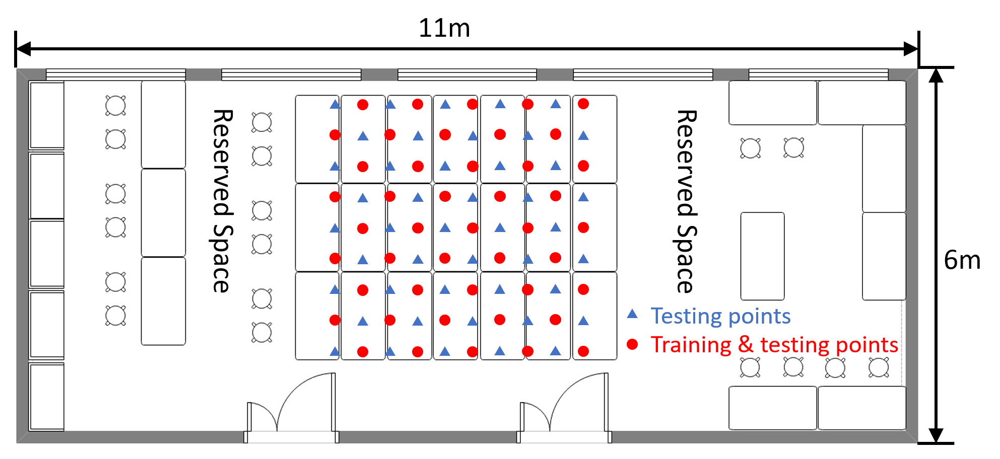
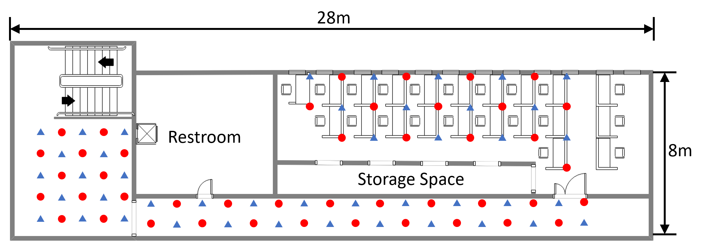

# Smartphone Collected CSI Dataset
This repository is the channel state information (CSI) dataset for
[CRISLoc: Reconstructable CSI Fingerprinting for Indoor Smartphone Localization](https://ieeexplore.ieee.org/stamp/stamp.jsp?tp=&arnumber=9187854), which is collected by Nexus 5 based on [Nexmon](https://github.com/seemoo-lab/nexmon_csi).

### CSI Data
The CSI data are stored in either `research_laboratory_APX.mat` or `academic_building_APX.mat`, where `X` is the index of APs, ranging from $1$ to $9$ or $10$ for the two scenarios.
Within each file, we have a double matrix of `number of data x number of subcarriers` as collected CSI _amplitude_. We only present `number of subcarrier` as 49 for the 49 effective subcarriers. Note that all the CSI data are pre-processed as mentioned in the paper, including the frame filtering and CSI calibration (by RSS, and it can be negative). 

### Position Label
The position label are stored in either `research_laboratory_position.mat` or `academic_building_position.mat`.
Within each file, we have a double matrix of `number of data x 2`, referring to the position of X axis and Y axis in meters. This position label are one-to-one mapping to the CSI data.

In this dataset, we mixed all the training/testing/reference data together and there is no difference for the labels in the figure.

### Research Laboratory

First, we set up a testbed in the center of a $6m\times 15m$ research laboratory on the desks. There are few multipath reflections and little disturbance. RSS and CSI are collected at 90 positions with $0.5m$ spacing. $9$ APs are placed inside the room.

### Academic Building

Then, we conduct the experiment on the third floor of an academic building. The test area is much more complex with many obstacles around. People walk around when fingerprints are collected, thus bringing disturbance to the data. The area covers an office, a corridor, and a lobby, and it is divided into grids with the edge width of $1.2m$ on average at the height ranging from $0.8m$ to $1.5m$. $10$ APs in all are deployed: $5$ in the corridor and $5$ in the office.
